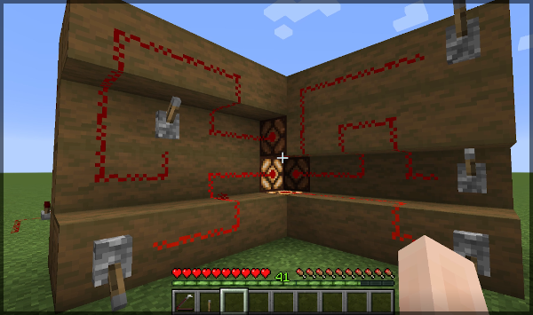
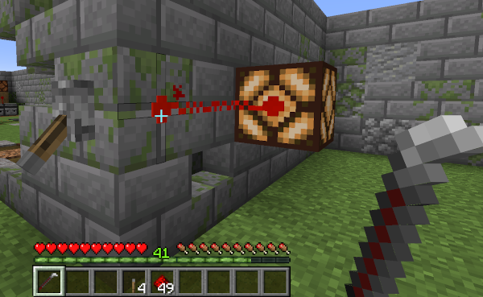
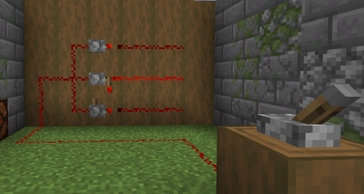
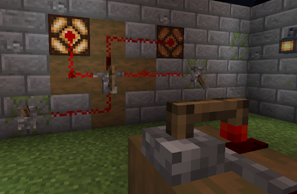
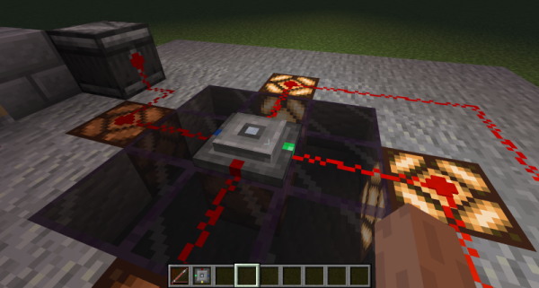
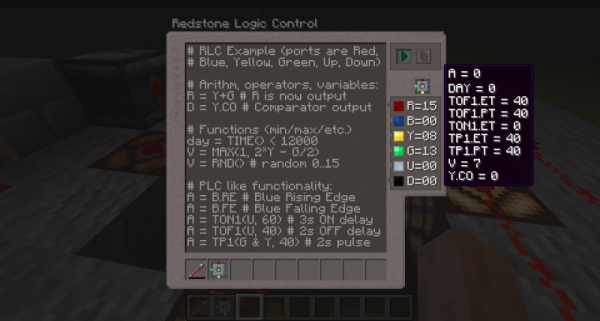
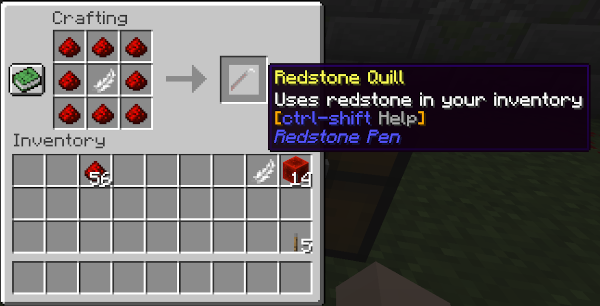
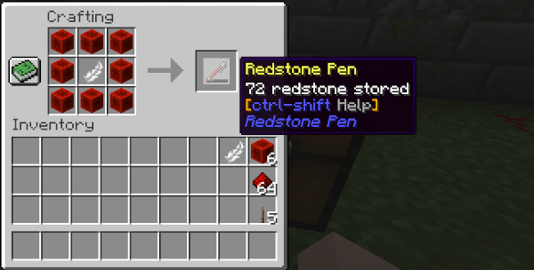
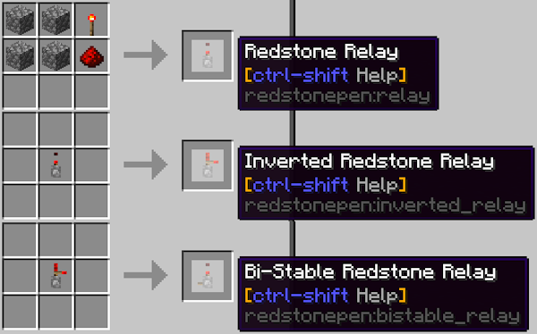

# Redstone Pen

A Minecraft Java Edition mod adding a pen to draw Redstone tracks more accurately.
Inspired by Redstone Paste.

## Fork Status

This fork continues development from the original archived project at
`stfwi/redstonepen`.

- Default branch: `main`
- Supported loader: NeoForge
- Current code base: derived from the original `neoforge-1.21` branch

## Project Links

- Original archive: https://github.com/stfwi/redstonepen
- Fork issues: https://github.com/whilestevego/redstonepen/issues
- Fork repository: https://github.com/whilestevego/redstonepen
- Changelog: [CHANGELOG.md](CHANGELOG.md)

## Description

Adds "one pen to draw them all" and helps with simpler Redstone handling.

### Redstone Quill and Pen Items

Craft and use them to draw or remove thin Redstone Tracks. Multiple independent
tracks through one block space are possible. There are two versions:

- The Redstone Quill uses Redstone dust directly from your inventory.
- The Redstone Pen stores Redstone in the item and can be refilled in the
  crafting grid with Redstone Dust or Redstone Blocks.
- Both allow you to inspect the current signal of a block, track, wire, or
  device by sneaking while holding the pen or quill and looking at the block of
  interest.
- Both do not destroy blocks when left-clicking, except blocks with no
  hardness, like grass, repeaters, or comparators.

### Block Signal Connectors

Especially for compact wiring it is desirable to decide whether a Track shall
power the block underneath or not. Therefore the Pen-Tracks do normally not
connect to the block they are drawn on. To change this, add an explicit
connector by clicking the centre of a Track with a Pen. Tracks intentionally do
not pass indirect power through blocks to other Tracks, so you can power those
blocks from independent routes without interference.

### Redstone Relays

Relays are like Redstone-powered solenoids that move built-in Redstone Torches
back or forth so that they re-power Redstone signals to 15. They can be placed
on solid faces in all directions. Output is only to the front, while inputs are
at all sides except from above. The internal mechanics define what happens at
the output side when the input signals change. Relays also detect indirect power
from blocks they are placed on and can therefore be used to pass Track signals
through blocks.

- **Redstone Relay:** Straight-forward input-on, output-on relay. Different
  from a Repeater, it has no switch-on delay, but instead a switch-off delay of
  one tick.
- **Inverted Redstone Relay:** Input-on, output-off relay. Switch-on delay one
  tick, no off delay.
- **Bi-Stable Redstone Relay:** Flips when detecting an off-to-on transition at
  the input.
- **Pulse Redstone Relay:** Emits a short pulse at the output side when
  detecting an off-to-on transition at the input.

- **Bridging Relay:** A Redstone Relay allowing tracks to cross. It forwards
  power back to front like a normal Relay and has an additional independent wire
  from left to right.

### Redstone Logic Control

Simplified PLC-like, text-code-based signal controller. See the detailed
documentation here:

- [Redstone Logic Control documentation](documentation/redstone-logic-control/readme.md)

### Recipes

## Community and References

- Discord: the Redstone Pen has a channel on the
  [Modded Redstone Discord server](https://discord.gg/6K958GsWq5)
- Credits: the Redstone Remote item is heavily inspired by Lothazar's Cyclic
  Remote Lever

## License

MIT. See `license`.
